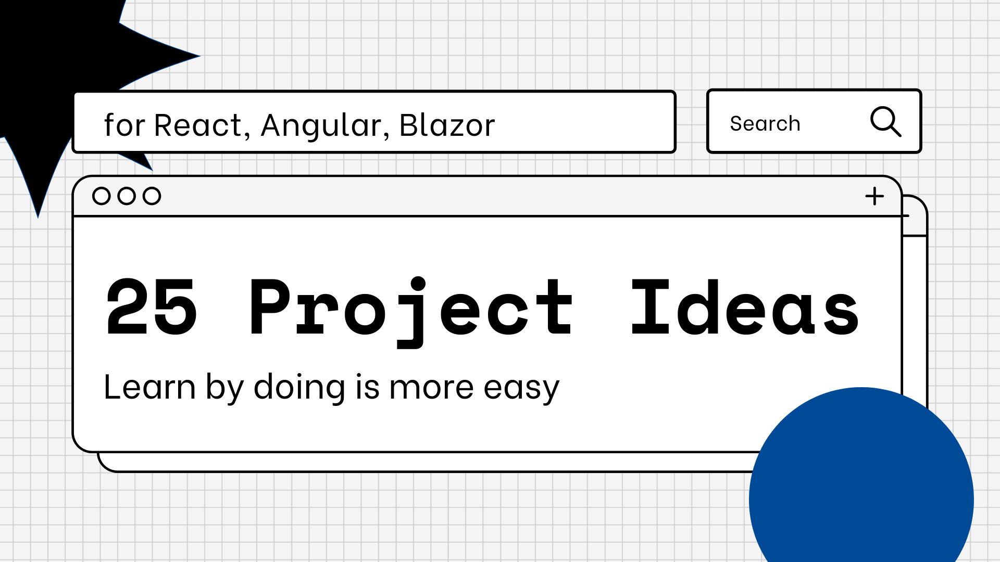

# What you will find here
A lot of tutorials, guides or blog posts teach you how to do the same things over and over again like a todo-app or a too easy example.
Very often they don't fit with a real implementation or a real world application.
In this repo you can find a lot of project ideas that you can use to learn something in a different way: try to do something really close to a real world project.

Many of the projects and good intentions fail because you don't have the ideas to begin with. or rather sometimes we don't have any idea for a new project at all.

This repo can help you to find a good example to learn something new for your next project at work.
All projects are compatible to be best used with React, Angular or Blazor.

# How it works
Every project has a brief description at the beginning and after that there are three levels of difficulty of things to implement.
You can use them as you think is best for you, but the right approach would be to start from the easiest to the most difficult.

There is also a small todo that can help you to implement all the main features of the project.
In addition, very often there are also third-party tools or services from which to take data without wasting time finding databases or useful data sources.

You can use the projects in any order you like.
They are not in any particular order, and each project has its own specific difficulties.

Enjoy the ideas and keep coding!

---

# Ideas

[01 - Star Wars Wiki](./IDEAS/01 - Star Wars Wiki.md)
